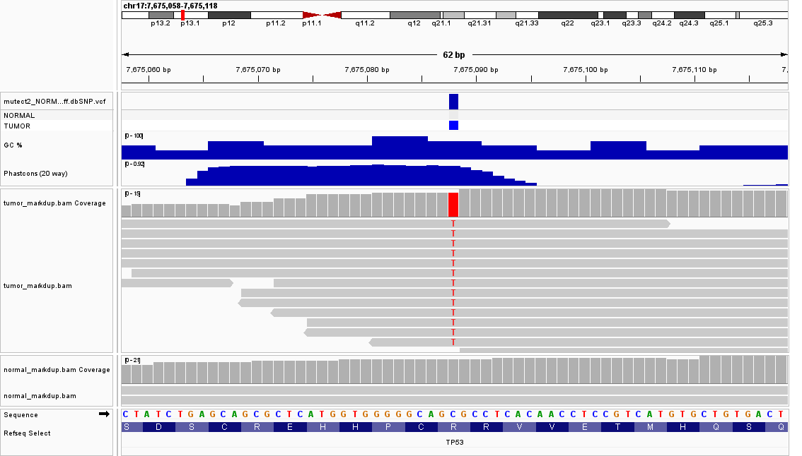

# Somatic Variant Calling Workflow
Documenting processing steps from FastQ QC to somatic variant calling using GATK4 on cell lines HCC1395 (ATCC, CRL-2324) and HCC1395BL (ATCC, CRL-2325).

## Data Download Strategy
- **Normal Sample (HCC1395BL):** SRR29788251
- **Tumor Sample (HCC1395):** SRR29788252
- **Subsampling:** Subsampled first 1,000,000 reads (-X 1000000) using fastq-dump to optimize EC2 disk usage during pipeline development.
- **Target Region:** Whole-genome reads; alignment will be performed on the whole genome.

## FastQC Processing of Raw Fastq Files
- **Per Base Sequence Quality:** Pass across all cycles.
- **Per Base Sequence Content:** Fail across all samples. However, this is due to fluctuations of >30% and <-20% in %T and %A content, respectively, were observed between base pairs 2 through 6. This is normal for Illumina Novaseq 6000. 
- **Adapter Content:** $<0.1\%$ contamination detected.
- **Trimming Decision:** High base quality ($Q > 30$); no preliminary trimming required prior to alignment.
- **Code:**
  ```bash
  #Bash
  #Run FastQC analysis
  bash fastqc_raw.sh
  ```

## Reference Genome Downloading and Indexing
- **Assembly:** GRCh38 Primary Assembly (GENCODE Release 44)
- **Indexing:** BWA whole-genome index built successfully (`.amb`, `.ann`, `.bwt`, `.pac`, `.sa`).
- **Code:**
  ```bash
  #Bash
  #Download and index reference genome
  bash download_index_reference.sh
  ```

## BWA Alignment of Raw, Paired Fastq Files to Reference Genome
- Aligned raw paired-end FASTQ reads to the human reference genome using BWA-MEM (v0.7.17), including proper read group headers required for downstream GATK processing.

- Reference Genome: GRCh38 primary assembly (GRCh38.primary_assembly.genome.fa)

- Algorithm: bwa mem with the -M flag enabled to mark shorter split hits as secondary (ensures Picard/GATK compatibility)

- Metadata & Read Groups: Applied complete Illumina @RG tags to preserve sample provenance across paired tumor/normal analyses:

- Normal Sample (SM:NORMAL): Run SRR29788251 (Library SRX25330419, Flowcell HCMCWDRX2.1)

- Tumor Sample (SM:TUMOR): Run SRR29788252 (Library SRX25330418, Flowcell HCLTMDSX3.1)

- Resource Optimization: Dynamically assigns CPU threads based on host capacity (nproc - 1).

- Output: Intermediate uncompressed SAM files (normal.sam, tumor.sam) directed to data/aligned/.

- Code:
   
  ```bash
  # Bash
  # Run alignment pipeline
  bash align_reads.sh
  ```
## Alignment Processing using Samtools

**Pipeline Overview**

This script automates post-alignment processing of raw SAM files into indexed BAM files using **samtools**, following standard practices (such as HBC Training guidelines) for downstream variant calling.

**Step-by-Step Execution Workflow**

  1. **Environment & Resource Allocation**
     - Sets strict shell execution modes (`set -euo pipefail`) to ensure robust error handling.
     - Creates logging directories and redirects outputs to a dedicated log file.
     - Dynamically allocates multithreading worker threads based on available CPU cores (`SAM_THREADS=$(nproc) -       1`).

  2. **Query-Name Sorting (`samtools sort -n`)**
     - Sorts the raw input SAM file (`${sample_name}.sam`) by query/read name.
     - Groups paired-end reads together, which is required for accurate mate-score tagging.

  3. **Mate Tagging (`samtools fixmate -m`)**
     - Fills in mate coordinates, flags, and adds mate-score tags (`-m`).
     - Prepares duplicate pair scoring metrics required for `samtools markdup`.
  
  4. **Genomic Coordinate Sorting (`samtools sort`)**
     - Re-sorts the alignment records by genomic coordinates (chromosome and start position).
     - Prepares the BAM file for position-based duplicate identification and indexing.
  
  5. **Duplicate Marking & Removal (`samtools markdup -r`)**
     - Identifies PCR and optical duplicate reads using the mate tags added during `fixmate`.
     - Removes marked duplicates from the alignment (`${sample_name}_markdup.bam`).
  
  6. **Indexing & Cleanup**
     - Generates a spatial index file (`.bai`) using `samtools index` to allow fast random access by downstream          tools.
     - Cleans up intermediate BAM files (`querysort`, `fixmate`, and `coordsort`) to conserve disk space.
  7. **Code**
      ```bash
      #Bash
      #Execute alignment processing script
      bash alignment_processing.sh
      ```
---

**Sample Processing**

The processing function is executed sequentially for both **`normal`** and **`tumor`** sample pairs.

### Post-Alignment Quality Control

Post-alignment quality control was performed on the deduplicated, indexed BAM files (`normal_markdup.bam` and `tumor_markdup.bam`) to evaluate alignment performance, library insert size distributions, and aggregate all QC metrics across the pipeline.

#### 1. Picard Metrics Collection (`CollectAlignmentSummaryMetrics` & `CollectInsertSizeMetrics`)

To complement `samtools flagstat` alignment metrics, Picard tools (v3.1.1) were executed to extract comprehensive mapping statistics and structural library characteristics:

* **Alignment Metrics (`CollectAlignmentSummaryMetrics`)**: Evaluated mapped read percentages, mismatch rates, and pairing distributions against the GRCh38 primary assembly.
* **Insert Size Metrics (`CollectInsertSizeMetrics`)**: Modeled the orientation and fragment size distribution of paired-end reads to ensure proper physical library performance prior to somatic variant calling.

**Key Findings:**
* **Median Insert Sizes**: Calculated at **151 bp** for the Normal sample (`HCC1395BL`) and **154 bp** for the Tumor sample (`HCC1395`), showing tight concordance across paired libraries.
* **Histogram Output**: Generated visual distribution plots (`normal_insert_size_histogram.pdf` and `tumor_insert_size_histogram.pdf`) displaying sharp, unimodal insert size distributions representative of high-quality short-read sequencing library preparation.

```bash
# Bash
# Execute Picard post-alignment QC metrics collection
bash alignment_qc.sh
```
#### 2. MultiQC Report Aggregation

Aggregated quality control metrics across all upstream processing steps into a single interactive HTML report (`somatic_variant_calling_multiqc_report.html`) using MultiQC (v1.19).

**Aggregated Module Summary:**
* **Raw FastQC**: Evaluates per-base sequence quality, GC content, and adapter contamination across raw FASTQ files (`results/fastqc/raw`).
* **Samtools Flagstat & Stats**: Assesses alignment yield, mapping efficiency, and duplicate read counts (`results/alignedqc`).
* **Picard Metrics**: Parses alignment metrics and insert size distributions (`results/alignedqc`).

**Aggregated Statistics:**

| Sample Name | Read Type | Duplication Rate (FastQC) | GC Content (FastQC) | Mapped Reads (Samtools) | Median Insert Size (Picard) |
| :--- | :--- | :--- | :--- | :--- | :--- |
| **Normal (HCC1395BL)** | Paired-End | ~6.28% | 52–53% | 1.81 M | 151 bp |
| **Tumor (HCC1395)** | Paired-End | ~8.38% | 51–52% | 1.75 M | 154 bp |

**Pipeline Quality Assessment:**
* **High Library Complexity**: Low duplication levels (< 10%) indicate minimal PCR bias and high genomic library diversity.
* **Balanced Sequencing Depth**: Uniform read depth and consistent GC content (~51–53%) between paired normal and tumor samples ensure unbiased germline subtraction and accurate somatic variant frequency calculations.
* **Status**: Both normal and tumor alignments pass quality control thresholds and are validated for downstream somatic variant calling (GATK4 Mutect2).

```bash
# Bash
# Execute MultiQC report aggregation script
bash multiqc_aggregate.sh
```

## Reference Genome Sequence Dictionary and FASTA Indexing

Generated two additional reference indices required by GATK (distinct from the BWA index used for alignment): a sequence dictionary and a FASTA index. Both were run as ad-hoc commands rather than a dedicated script.

- **Sequence Dictionary (`gatk CreateSequenceDictionary`):** Produces the `.dict` file GATK uses to validate contig names/lengths and enable random access across tools (Mutect2, FilterMutectCalls, GetPileupSummaries, etc.).
- **FASTA Index (`samtools faidx`):** Produces the `.fai` index enabling fast random access into the reference FASTA by coordinate.

**Code:**
```bash
# Bash
# Create sequence dictionary
gatk CreateSequenceDictionary \
  -R data/reference/GRCh38.primary_assembly.genome.fa \
  -O data/reference/GRCh38.primary_assembly.genome.dict

# Create FASTA index
samtools faidx data/reference/GRCh38.primary_assembly.genome.fa
```

**Output:** `GRCh38.primary_assembly.genome.dict` and `GRCh38.primary_assembly.genome.fa.fai` generated successfully alongside the existing BWA index files (`.amb`, `.ann`, `.bwt`, `.pac`, `.sa`).

## Panel of Normals (PoN) Download

Downloaded the GATK Best Practices somatic panel of normals, used by Mutect2 to filter out recurrent technical artifacts and rare germline variants that appear across unrelated normal samples.

- **Resource:** `1000g_pon.hg38.vcf.gz` (+ `.tbi` index), from the public GATK Best Practices resource bucket (`gs://gatk-best-practices/somatic-hg38/`) — the same bucket later used for the `small_exac_common_3.hg38.vcf.gz` contamination resource.

**Code:**
```bash
# Bash
# Download panel of normals
wget -P data/resources/ https://storage.googleapis.com/gatk-best-practices/somatic-hg38/1000g_pon.hg38.vcf.gz
wget -P data/resources/ https://storage.googleapis.com/gatk-best-practices/somatic-hg38/1000g_pon.hg38.vcf.gz.tbi
```

**Output:** `1000g_pon.hg38.vcf.gz` (17 MB) and its index stored in `data/resources/`.

## Somatic Variant Calling with GATK Mutect2

Called candidate somatic variants by running GATK4 Mutect2 in matched tumor-normal mode, comparing the tumor (`tumor_markdup.bam`) against the matched normal (`normal_markdup.bam`), with the panel of normals supplied to suppress recurrent artifacts.

- **Inputs:** `normal_markdup.bam` (`NORMAL`), `tumor_markdup.bam` (`TUMOR`), GRCh38 primary assembly reference, `1000g_pon.hg38.vcf.gz` panel of normals.
- **Annotations:** Requested standard QC annotations (`ClippingRankSumTest`, `DepthPerSampleHC`, `MappingQualityRankSumTest`, `MappingQualityZero`, `QualByDepth`, `ReadPosRankSumTest`, `RMSMappingQuality`, `FisherStrand`, `MappingQuality`, `DepthPerAlleleBySample`, `Coverage`).
- **Output:** Raw, unfiltered somatic VCF (`mutect2_NORMAL_TUMOR_GRCh38.raw.vcf`) plus its companion `.stats` file (used later by `FilterMutectCalls`).

**Key Findings:**
- **Raw Candidate Variants:** 176 candidate somatic variant records emitted prior to any filtering. Given the pipeline is developed on a 1-million-read subsample per sample (rather than full-depth sequencing), this is an expected, modest number — not the final call set.

**Code:**
```bash
# Bash
# Run GATK Mutect2 somatic variant calling
bash gatk_mutect2.sh
```

## Contamination Estimation (GetPileupSummaries & CalculateContamination)

Prior to filtering the raw Mutect2 calls, estimated cross-sample DNA contamination using GATK's `GetPileupSummaries` → `CalculateContamination` workflow, since library prep or sequencing can occasionally introduce reads from a genetically distinct source that would otherwise confound somatic filtering.

- **Germline Resource:** `small_exac_common_3.hg38.vcf.gz`, a curated panel of ~59,295 common, biallelic population SNPs, from the same GATK Best Practices bucket as the panel of normals.
- **Procedure:** Ran `GetPileupSummaries` independently on both the tumor and normal BAMs against this SNP panel, then ran `CalculateContamination` on the tumor pileups using the normal as the matched sample (also producing a tumor minor-allele-fraction segmentation used to distinguish copy-number-driven allelic imbalance from true contamination).

**Key Findings:**
- **Site Coverage:** Of the sites retained in each pileup table, >99.9% carried real read coverage in both samples (19,561 / 19,579 tumor sites; 19,408 / 19,420 normal sites) — a coverage density consistent with the underlying FASTQ data being whole-exome sequencing (WXS) rather than whole-genome, since exome capture concentrates reads onto the coding regions where this SNP panel's sites are drawn from.
- **Contamination Estimate:** 0.77% (± 0.25% SE) in the tumor sample — well below the ~5% threshold that would indicate meaningful cross-sample contamination. Given the near-universal site coverage above, this is a well-powered, reliable estimate.
- **Tumor Segmentation:** Minor allele fractions across chromosomal segments ranged from ~0.15 to ~0.48, consistent with allelic imbalance driven by HCC1395's well-documented aneuploid, copy-number-unstable genome (at coarse resolution, given the modest number of informative SNPs available).

**Code:**
```bash
# Bash
# Run contamination estimation workflow
bash contamination_cleanup.sh
```

## Somatic Variant Calling Re-run with a Germline Resource

Re-ran GATK Mutect2 with a population germline resource (`af-only-gnomad.hg38.vcf.gz`) added to the call, so that population allele frequency (POPAF) annotations would be based on real gnomAD data instead of a flat default. This was a targeted addition rather than a full pipeline re-run: with tumor and normal derived from the same patient, the matched-normal comparison already captures most of this patient's own germline variants directly, but since both samples are shallow 1-million-read subsamples, a population resource adds useful corroborating evidence at sites the normal alone under-covers.

- **Germline Resource:** `af-only-gnomad.hg38.vcf.gz` (~3.18 GB), from the same GATK Best Practices resource bucket as the panel of normals and contamination SNP panel.
- **Script Updates:** Added `--germline-resource` to `gatk_mutect2.sh`; corrected the Java heap allocation to `-Xmx6g` (appropriate for the 8 GB EC2 instance); routed all script output (not just the GATK command) into the run log.
- **Verification:** Confirmed via the raw VCF's own `##GATKCommandLine` header that the germline resource and panel-of-normals flags were both actually applied, not just present in the script.

**Key Findings:**
- **Raw Candidate Variants:** 176 candidate somatic variant records — unchanged from the original run, confirming the germline resource affects variant *annotation* rather than *emission*.
- **POPAF Spot-Check:** Of the 176 candidates, 148 still received the tumor-normal-mode "not-in-resource" default (POPAF = 6.00), while the remaining ~28 received real gnomAD-derived population allele frequencies (ranging from 0.008 to 8.33) — confirming the resource was genuinely consulted at those sites.
- **Runtime:** 48.52 minutes.

**Code:**
```bash
# Bash
# Re-run GATK Mutect2 with the germline resource added
bash gatk_mutect2.sh
```

## Variant Filtering with FilterMutectCalls

Filtered the raw Mutect2 calls with `FilterMutectCalls`, supplying the contamination and tumor-segmentation tables generated earlier, then compared the resulting FILTER-column breakdown against a prior run made without the germline resource to assess what the added population data changed.

- **Inputs:** `mutect2_NORMAL_TUMOR_GRCh38.raw.vcf`, `contamination_NORMAL_TUMOR.table`, `segments_TUMOR.table`.
- **Output:** Filtered somatic VCF (`mutect2_NORMAL_TUMOR_GRCh38.filtered.vcf`) with per-variant FILTER annotations and an accompanying `filteringStats.tsv`.

**Key Findings:**
- **Bottom line unchanged:** 176 total candidates and 12 `PASS` variants in both the original and germline-resource-informed runs — the germline resource did not alter the confident somatic call set.
- **`weak_evidence` concern resolved:** the total count of variants carrying a `weak_evidence` tag was identical (151) in both runs, as expected since that filter is driven by read-support log-odds (TLOD), independent of population allele frequency. Only the *alone* count shifted (109 → 104), because 5 of those variants now also carry a `germline` tag now that gnomAD has real data at those positions — same variants, same outcome, better-explained reason.
- **`germline` filtering improved:** germline-tagged variants rose from ~7 to 26, and in the new run every one is paired with at least one other filter reason rather than firing alone — consistent with real, corroborated evidence replacing a flat default at the ~28 gnomAD-informed sites.
- **`contamination` tagging also rose (~15 → 31)** despite an unchanged contamination estimate (0.77%), consistent with GATK's contamination filter also weighing population allele frequency alongside the contamination table.

**Code:**
```bash
# Bash
# Filter the germline-resource-informed Mutect2 calls
bash filter_calls.sh
```

## Variant Filtering: PASS-Only Selection (SnpSift)

Narrowed the filtered VCF down to a confident somatic call set by keeping only records marked `PASS` in the FILTER column. Records carrying any other filter reason (e.g. `weak_evidence`, `germline`, `contamination`) were left in the filtered VCF untouched rather than discarded, since some — particularly the 104 `weak_evidence` calls — may reflect insufficient read support from the 1-million-read subsampling depth rather than genuine false positives; they remain available for re-evaluation in a future higher-coverage re-run rather than being permanently excluded from consideration.

- **Tool:** SnpSift (SnpEff suite, v5.4c), installed in a dedicated `annotation_env` conda environment (openjdk ≥21) separate from the `variant_env` used for GATK, since the bioconda SnpEff/SnpSift builds require Java 21 while GATK requires Java 17.
- **Input:** `mutect2_NORMAL_TUMOR_GRCh38.filtered.vcf` (176 records).
- **Output:** PASS-only VCF (`mutect2_NORMAL_TUMOR_GRCh38.pass.vcf`).

**Key Findings:**
- **PASS Variants Retained:** 12 of 176 candidate records, consistent with the FILTER-column breakdown from the FilterMutectCalls comparison above.

**Code:**
```bash
# Bash
# Keep only PASS-filtered variants
bash snpsift_pass_filter.sh
```

## Variant Filtering: Low-Complexity Region (LCR) Removal (SnpSift)

Removed any remaining variants overlapping low-complexity genomic regions (simple sequence repeats), which are known to produce spurious variant calls disproportionate to their share of the genome (~2% of the genome, but ~80–90% of erroneous heterozygous indel calls in the literature this step is based on).

- **Resource File:** `LCR-hs38.bed` (from `github.com/lh3/varcmp`), kept with its native `chr`-prefixed contig names to match this project's GENCODE GRCh38 primary assembly reference (unlike the base course lesson, which strips the `chr` prefix to match its own non-prefixed reference).
- **Procedure:** Used `SnpSift intervals -x` to exclude any PASS variant overlapping an interval in the LCR BED file.
- **Input:** `mutect2_NORMAL_TUMOR_GRCh38.pass.vcf` (12 records).
- **Output:** Final filtered VCF (`mutect2_NORMAL_TUMOR_GRCh38.pass.no_lcr.vcf`).

**Key Findings:**
- **Variants Retained:** 12 of 12 PASS variants survived LCR filtering — none overlap a low-complexity region, indicating the final candidate set sits entirely in non-repetitive, well-behaved genomic sequence.

**Code:**
```bash
# Bash
# Remove variants overlapping low-complexity regions
bash LCR_filter.sh
```

## Variant Annotation with SnpEff (Cancer Mode)

Annotated the 12 final candidate variants with predicted functional consequences (e.g. missense, nonsense, intronic) using SnpEff, run in cancer-mode to make explicit use of the tumor/normal pairing.

- **Pedigree Header:** Added `##PEDIGREE=<Derived=TUMOR,Original=NORMAL>` to the VCF via `bcftools annotate --header-lines`, adapted from the course's `syn3_normal`/`syn3_tumor` example to this project's own sample names. This tells SnpEff's cancer mode that TUMOR is derived from NORMAL, enabling paired-sample-aware annotation.
- **Database:** `hg38` (SnpEff v5.4c) — a UCSC-sourced, RefSeq-based, `chr`-prefixed build, chosen deliberately over Ensembl-style builds (bare chromosome names) and `hg38kg` (UCSC KnownGenes, a broader/less-curated transcript set) to natively match this project's GENCODE reference and stay consistent in spirit with the course's own RefSeq-based database choice.
- **Environment:** Run via `annotation_env` (the same conda environment created for SnpSift, Java 21) using `_JAVA_OPTIONS` to set heap size, since the bioconda `snpEff` wrapper's handling of Java flags passed directly on the command line wasn't verified.
- **Output:** Annotated VCF (`mutect2_NORMAL_TUMOR_GRCh38.snpeff.vcf`) plus HTML and CSV summary reports.

**Key Findings:**
- **Variants Annotated:** All 12 PASS/LCR-filtered candidates received functional annotations, visible in the SnpEff HTML summary report.

**Code:**
```bash
# Bash
# Append pedigree header and run SnpEff cancer-mode annotation
bash snpeff_annotate.sh
```

## Variant Annotation: dbSNP Cross-Reference (SnpSift)

Cross-referenced the 12 annotated variants against dbSNP to flag any that correspond to previously catalogued variants.

- **Resource:** `Homo_sapiens_assembly38.dbsnp138.vcf.gz` (+ `.tbi`), from the Broad Institute's public GATK reference bucket — `chr`-prefixed, matching this project's reference without requiring contig renaming (unlike NCBI's own dbSNP VCF, which uses RefSeq accession-style contig names).
- **Procedure:** Ran `SnpSift annotate -tabix` against the SnpEff-annotated VCF.
- **Output:** Final annotated VCF (`mutect2_NORMAL_TUMOR_GRCh38.snpeff.dbSNP.vcf`).

**Key Findings:**
- **dbSNP Matches:** 2 of 12 candidate variants correspond to existing dbSNP entries (`rs376917408`, `rs28934578`); the remaining 10 are not catalogued in dbSNP. A dbSNP match does not by itself indicate a common/benign polymorphism — dbSNP catalogues rare and clinically significant variants as well, including recurrent cancer mutations reported across studies — so these two are not excluded from further consideration on this basis alone.

**Code:**
```bash
# Bash
# Cross-reference annotated variants against dbSNP
bash snpsift_dbsnp_annotate.sh
```

## Variant Prioritization: Field Extraction and Annotation Review

Flattened the annotated, dbSNP-cross-referenced VCF into a single tabular file for manual review, then cross-referenced the resulting candidate genes against curated cancer driver-gene resources.

- **Extraction:** Used `SnpSift extractFields` to pull CHROM/POS/REF/ALT/ID, the top (most severe) SnpEff annotation per variant (`ANN[0].*`), and per-sample allele fraction/depth (`GEN[TUMOR/NORMAL].AF`, `.AD`) into a single TSV. Chose top-annotation-only over exploding every transcript annotation (via `vcfEffOnePerLine.pl`) or comma-joining all annotations, since this variant set is small enough that one row per variant is easiest to review manually, while full multi-transcript detail remains recoverable from the annotated VCF if ever needed.
- **Effective variant count:** 11 distinct events, not 12 — the two adjacent `TUBGCP6` records (chr22:50220941, chr22:50220944) share the same gene/transcript, nearly identical allele depths and fractions, and fall in the same codon, and are almost certainly one complex substitution that Mutect2 represented as two overlapping simple calls.
- **Read-support pattern:** All 12 records show zero alt-supporting reads in NORMAL (`GEN[NORMAL].AD` second value = 0 across the board), consistent with clean tumor/normal separation.
- **Impact breakdown:** 7 MODERATE (missense), 3 LOW (synonymous), 1 MODIFIER (downstream), treating the TUBGCP6 pair as one MODERATE event.
- **Cancer driver cross-reference:** Checked the 10 non-TP53 genes against the COSMIC Cancer Gene Census and OncoKB curated driver/actionable gene lists; none are present on either list.

**Key Findings:**
- **TP53 p.Arg175His (c.524G>A, rs28934578):** chr17:7675088, TUMOR AF=0.893 (AD 0,10), NORMAL AD=16,0. This is one of the most extensively studied p53 hotspot mutations, and it is independently listed as HCC1395's own documented TP53 variant in [Cellosaurus](https://www.cellosaurus.org/CVCL_1249) (cross-referenced to ClinVar) — strong confirmation that the pipeline recovered a real, cell-line-validated mutation rather than an artifact.
- **Elevated tumor allele fractions** (TP53 0.893, MIR4539 0.909, ZNF202 0.8, FMNL3 0.75): higher than the ~0.5 expected for a simple heterozygous somatic mutation, plausibly reflecting loss of heterozygosity or copy-number gain of the mutant allele — consistent with HCC1395's known aneuploid, copy-number-unstable genome (see the `CalculateContamination` segmentation results above, minor allele fractions 0.15–0.48).
- **No other established driver genes:** none of OSTC, PCDHGB1, TRIB1, DDB2, ZNF202, FMNL3, MIR4539, RPRD1A, ARFGAP1, or TUBGCP6 are on the COSMIC Cancer Gene Census or OncoKB gene lists. A couple have gene-level cancer literature worth noting without over-interpreting: FMNL3 has published links to breast cancer cell migration/invasion via Twist1 regulation, though the variant found here is synonymous and would not alter the protein; DDB2 is a nucleotide-excision-repair gene (linked to xeroderma pigmentosum group E) with an emerging cancer-biology literature, though not a currently catalogued driver.
- **Low-depth caveat:** DDB2, ZNF202, FMNL3, and ARFGAP1 are supported by only 3–5 total reads, a direct consequence of the 1M-read subsampling used for this project; these calls are lower-confidence than the others and would benefit from re-evaluation at full sequencing depth.

**Code:**
```bash
# Bash
# Flatten annotated VCF into a variant table (top annotation per variant)
bash snpsift_extract_fields.sh
```

## Variant Visualization with IGV

Loaded the final annotated, dbSNP-cross-referenced VCF alongside the tumor and normal BAM files in IGV Desktop (v2.19.8, installed and run locally on Windows rather than via Harvard's O2/FileZilla file-transfer workflow, since this project's files already live outside that HPC environment) to visually inspect read-level support for the candidate variants.

- **Genome build:** Human (GRCh38/hg38), matching the reference used throughout this pipeline.
- **Tracks loaded:** the annotated VCF (`mutect2_NORMAL_TUMOR_GRCh38.snpeff.dbSNP.vcf`), both alignment files (`tumor_markdup.bam`, `normal_markdup.bam`), and IGV's built-in CpG Islands, GC %, and Phastcons (20 way) tracks for additional genomic context.
- **Focus variant:** TP53 p.Arg175His (chr17:7,675,088), the pipeline's strongest candidate (see Variant Prioritization above).

**Key Findings:**
- At base-pair resolution, every tumor read overlapping chr17:7,675,088 carries the alt allele (T, highlighted red), while every normal read at the same position is reference-only (no highlighting) — a direct visual confirmation of the AD 0,10 (tumor) / 16,0 (normal) split reported by the extraction step.
- Coverage in both BAM tracks shows a single isolated depth peak over the targeted exon rather than uniform depth across the window, the expected pattern for hybrid-capture WXS data rather than WGS.
- Raw IGV pileup depth at the variant (tumor ~19x, normal ~21x) runs somewhat higher than Mutect2's own reported AD totals (10 and 16, respectively) — expected, since Mutect2 applies its own additional read filtering and local reassembly before computing AD, rather than a discrepancy in the underlying data.

**Note:** This step was performed interactively in IGV Desktop rather than via a script. A wider-context screenshot of the locus is available at `img/TP53_snapshot.png`; the saved IGV session file was left out of this repository since it references absolute file paths local to the machine it was saved on and would not restore correctly for anyone else cloning this repo.



*IGV view (62 bp window, chr17:7,675,058–7,675,118) showing tumor reads (top) uniformly carrying the T alt allele at the TP53 R175H position, and normal reads (bottom) uniformly reference at the same site.*
